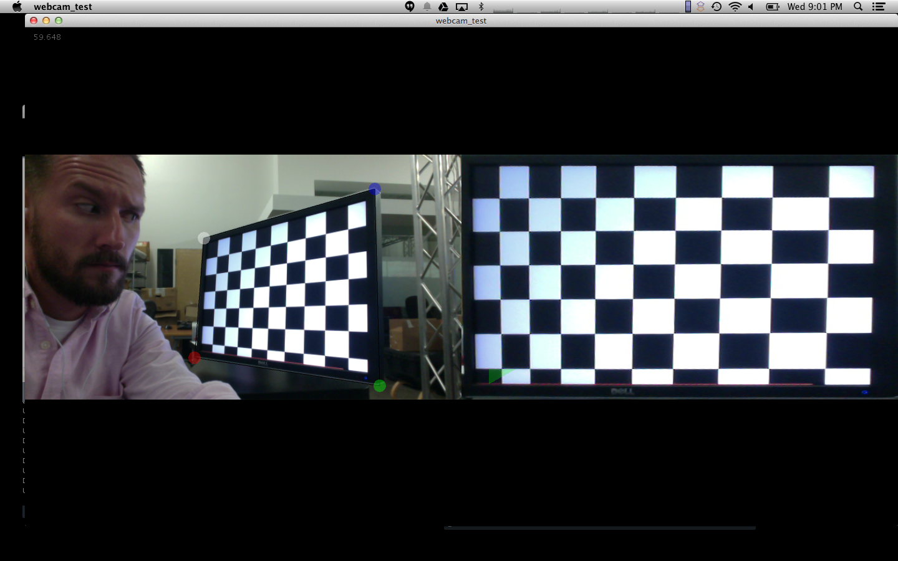

glsl_keystone_correction
========================

A Processing sketch to correct for keystone distortion in live video of a surface like a whiteboard or table display.

## Interface ##

The interface shows two versions of the live webcam feed (or test image when no camera is available). The left side displays the unwarped image with a keystone bounding widget overlay. The right side displays the warped and cropped area bounded by the keystone widget.
  

## Usage ##

Drag the corners of the keystone widget in the left video feed to fit over the rectangular surface you wish to focus on in the feed. The settings are saved automatically to a file "calib.txt" and read in on startup if present.

Press 'r' to reset the keystone widget to contain the entire image.

Press 'm' to toggle the mesh visualization overlay.

The UP and DOWN arrows will increase the resolution of the mesh used to warp the image.

## Notes ##

The warping is accomplished by mapping a triangular mesh over the warped image and the keystone bounding quad. The individual pixels are then interpolated using barycentric coordinates in a fragment shader.
  

  
As seen in the above example image, this approach does not actually correct for perspective distortion, but does an adequate job for small displacements. OpenCV and similar libraries provide methods for calculating the perspective transformation from the set of 4 points forming the keystone boundary. This matrix only needs to be calculated when the keystone boundaries change.
